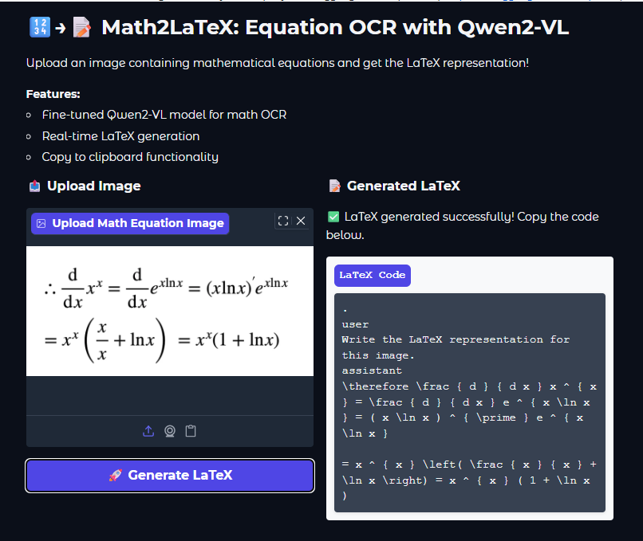

# Math2LaTeX: Equation OCR to LaTeX with Qwen2 VL 🔢→📝

Convert handwritten or typeset mathematical equations into clean LaTeX code using a fine-tuned Qwen2-VL vision-language model.

## Overview

This project fine-tunes the Qwen2-VL-7B model to perform mathematical OCR (Optical Character Recognition), transforming images of equations into properly formatted LaTeX markup. Perfect for digitizing mathematical content from papers, textbooks, or handwritten notes.

## Features

- **Vision-Language Model**: Fine-tuned Qwen2-VL-7B for math equation recognition
- **Efficient Training**: LoRA (Low-Rank Adaptation) for cost-effective fine-tuning
- **Interactive Demo**: Gradio web interface with image upload and live LaTeX preview
- **Export Options**: Copy to clipboard or save as .tex files
- **Accuracy Metrics**: Evaluated on exact match and token-level accuracy

## UI

  

## Results Demo

  

## Quick Start

1. **Best to test it on google colab (free gpu is enough)**

2. **Run Training**

- Training and testing is done in the comprehensive notebook: math2latex.ipynb

3. **Launch Demo**

- Gradio Demo is available at the end of the notebook math2latex.ipynb

## Model Details

- **Base Model**: Qwen2-VL-7B-Instruct
- **Quantization**: 4-bit for memory efficiency
- **Fine-tuning**: LoRA with r=16, targeting both vision and language layers
- **Dataset**: Unsloth LaTeX OCR dataset
- **Training**: 30 steps with gradient accumulation

## Usage

Upload an image containing mathematical equations, and the model will generate the corresponding LaTeX code. The demo provides instant preview and export functionality.

## Performance

The model achieves strong performance on mathematical equation recognition with comprehensive evaluation metrics including exact match accuracy and token-level precision.

---

_Built with PyTorch, Unsloth, and Gradio_
